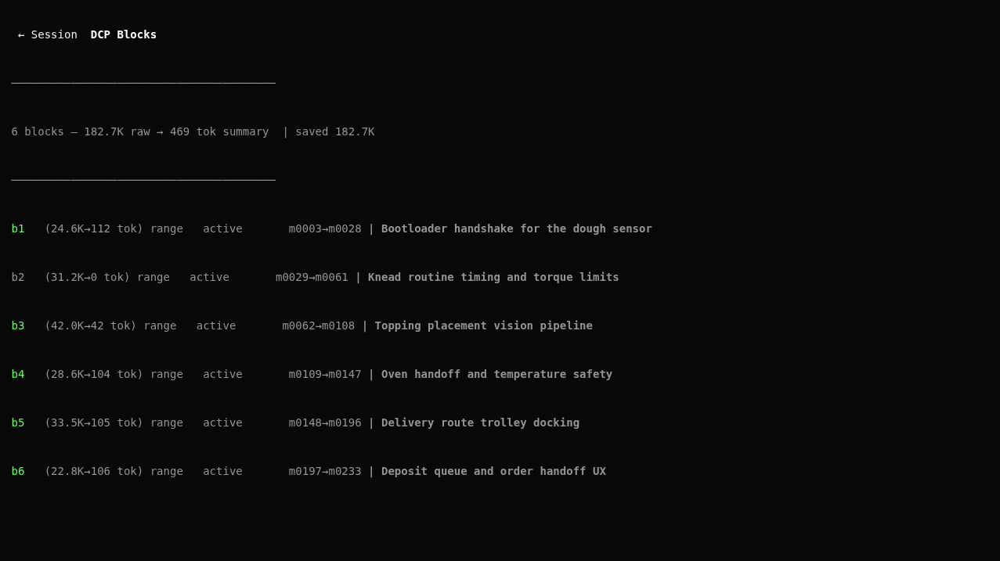
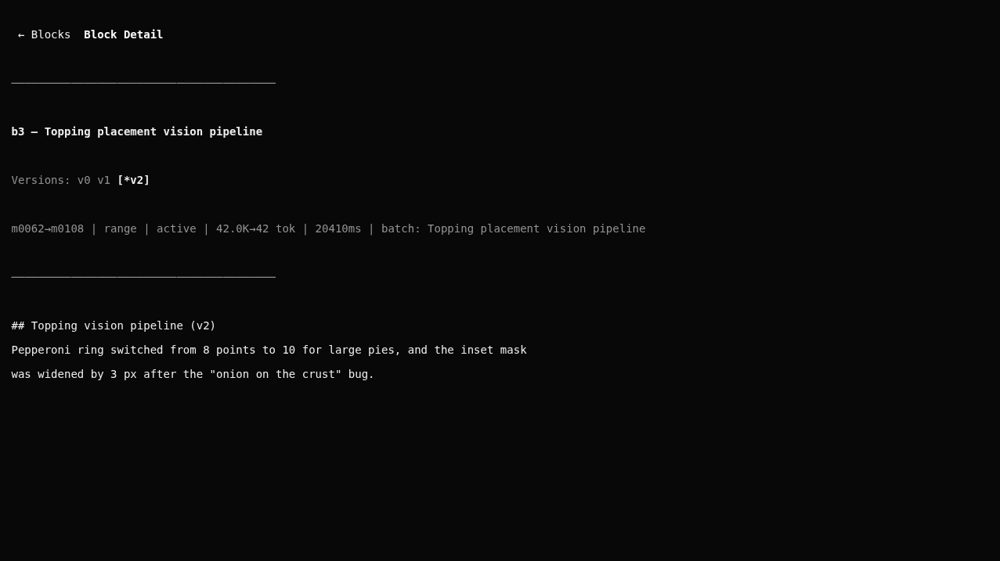
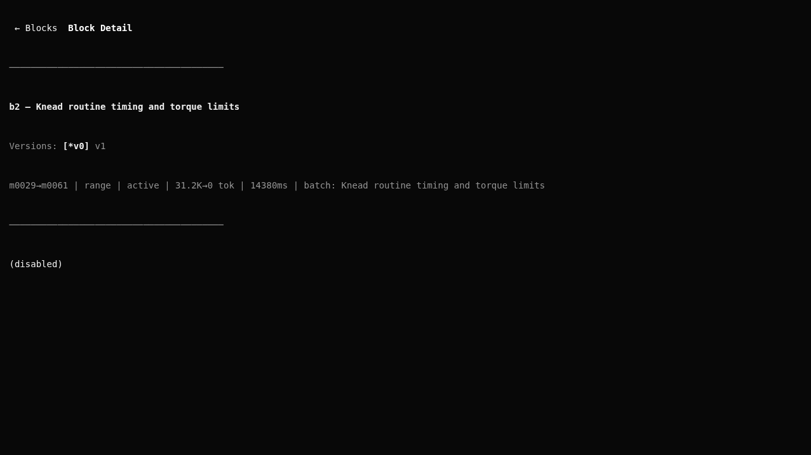
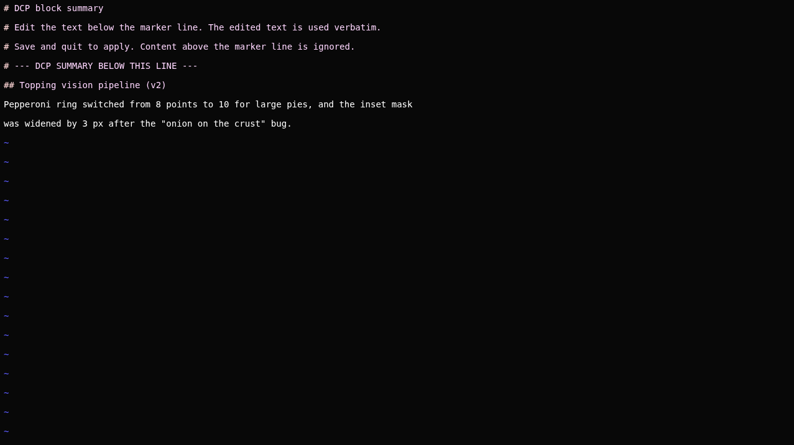
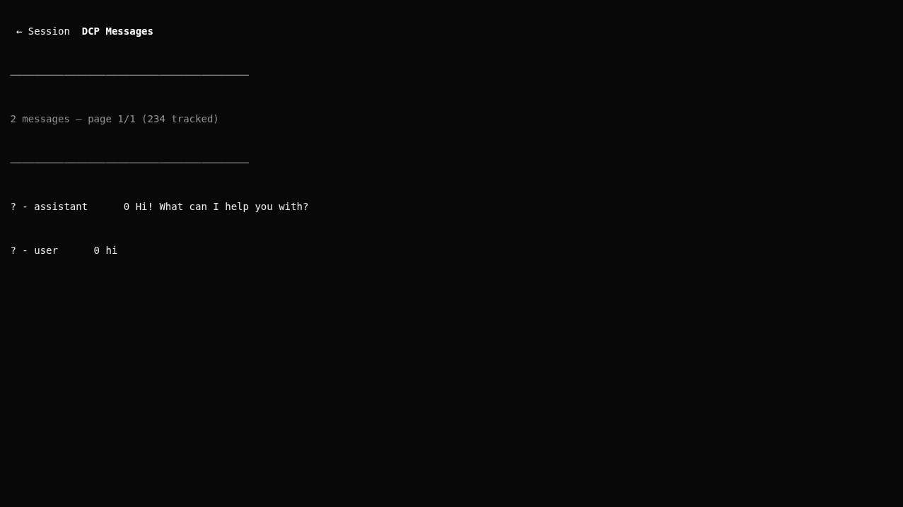
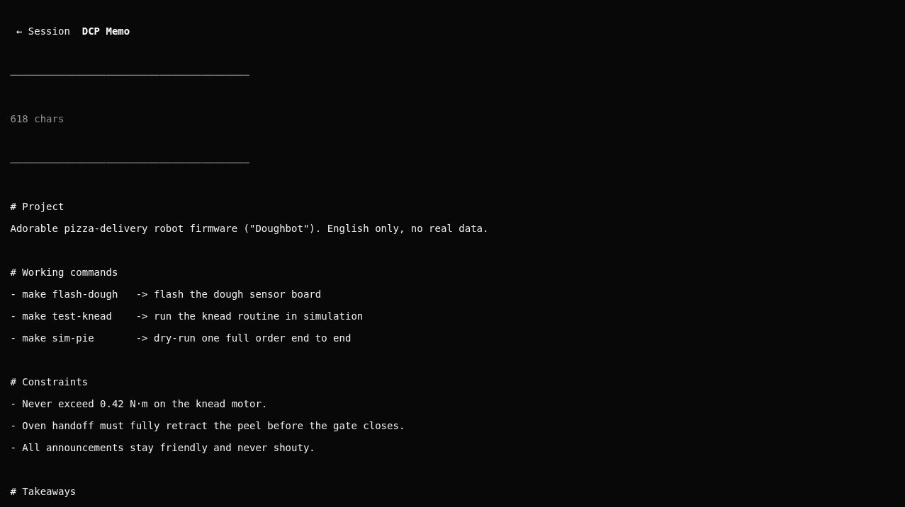

# OpenCode-HyperDCP

**OpenCode-HyperDCP** is a context management plugin for the [OpenCode](https://opencode.ai) AI coding agent, forked from [**opencode-dynamic-context-pruning**](https://github.com/Opencode-DCP/opencode-dynamic-context-pruning) (v3.1.12, [this commit](https://github.com/yuriha-chan/OpenCode-HyperDCP/tree/0657cd2fd50e9891cd69eae3787bcf280fabc2ba)).

## Philosophy

An AI agent's context window is not a black box. Most tools silently compress, summarize, or drop conversation history, and you are left hoping nothing important was lost. HyperDCP takes the opposite stance: **the context window should be 100% observable and 100% controllable by you.**

Every compression is a *visible block*. Nothing is hidden, nothing is automatic:

- **Observable** — you can inspect exactly what was compressed, what survived, and how much was saved.
- **Controllable** — you can rewrite a summary, switch to a different version, protect a message, or cull a block entirely.
- **Lossless-in-practice** — nothing is forgotten unless you decide it should be; uncovered content is surfaced rather than quietly discarded.

The plugin never compresses on its own. It only *reminds* (a nudge) that context is getting large, so the decision stays with you — unless you opt in to let the agent act on its own (see below).

## Automatic, yet observable

HyperDCP also gives the **agent** the same controls you have, so Context management can happen mid-task without breaking the observable model. Each action stays a visible block or edit rather than a silent side effect.

- `recall_compressed` — search and retrieve the original messages that were folded into any compressed block, so the agent can recover exact detail on demand.
- `rewrite_summary`, `edit_summary`, `append_summary`, `save_summary`, `fetch_summary_versions` — read and revise a block's summary as new versions.
- `expand_block` — extend a block's range to absorb newly uncovered messages.
- `edit_memo` / `read_memo` — maintain durable project memory outside the volatile chat history.

When **autotoggle** is enabled, the agent may also call `toggle_summary_version` itself to switch a block to a different version, or to version `v0` to **cull** a block entirely — the same actions you can take by hand, just automated. Every change remains visible in the block list and reversible.

## Feature tour

### Block list — see every compressed range at a glance

The sidebar lists each block with its range, mode, active version, token cost, and topic. A summary header shows the running total of raw tokens saved.



### Block detail — per-version tabs

Open a block to read its summary. Every block keeps multiple versions; tabs mark the currently active one with `*` (here `[*v2]`). Switching tabs is view-only — it does not change which version is live.



### Culling — deliberately forget a range

A block can be set to version `v0`, which hides its summary while still pruning the covered messages. The detail page shows `(disabled)`, and the block reads `31.2K→0 tok`. This is how you intentionally drop context you no longer need.



### Edit summaries in `$EDITOR`

Press the edit binding on a block to hand the summary to your `$EDITOR` through a header-delimited temp file; save and quit to apply it as a new active version. The sidebar list can also be collapsed to reclaim screen space.



### Messages view — inspect the tracked chain

Browse the underlying messages and their compression state, page by page.



### Memo — durable, editable project memory

A per-session memo that survives compaction and can be edited in place, keeping working commands, constraints, and takeaways out of the volatile chat history.



## Installation

OpenCode installs plugins directly from npm by name — no local build required.

1. Add the package (and its TUI companion) to your OpenCode config,
   `~/.config/opencode/opencode.json`:

   ```json
   {
     "$schema": "https://opencode.ai/config.json",
     "plugin": ["@architectural-composition/opencode-hyperdcp"]
   }
   ```

   Scoped npm packages are supported. OpenCode installs the plugin automatically
   with Bun at startup and caches it under `~/.cache/opencode/node_modules/`.

2. The TUI pages and sidebar are registered through `~/.config/opencode/tui.json`:

   ```json
   {
     "$schema": "https://opencode.ai/tui.json",
     "plugin": ["@architectural-composition/opencode-hyperdcp"]
   }
   ```

   Alternatively, add the package with the CLI, which writes these entries for you:

   ```sh
   opencode plugin add @architectural-composition/opencode-hyperdcp
   ```

3. Restart OpenCode. Package updates are managed with `opencode plugin list`,
   `opencode plugin check`, and `opencode plugin update`.

## Usage

1. Open the DCP pages from the command palette (`ctrl+p`) with `/dcp-tui-blocks`,
   `/dcp-tui-messages`, or `/dcp-tui-memo`.
2. When context grows, act on the nudge:
   - review blocks in the **DCP Blocks** sidebar,
   - rewrite or switch a summary version,
   - protect messages you must keep, or cull blocks you no longer need.

The plugin ships alongside server-side commands (`/dcp ...`) and AI tools (search & retrieve of compressed messages) for finer-grained control.

## Notes

- This README is an overview, not a manual. See the code and `KNOWN-ISSUES.md` for current behavior and limitations.
- Screenshots are generated by the PTY-driven capture harness in `scripts/` (see `scripts/README.md`).
